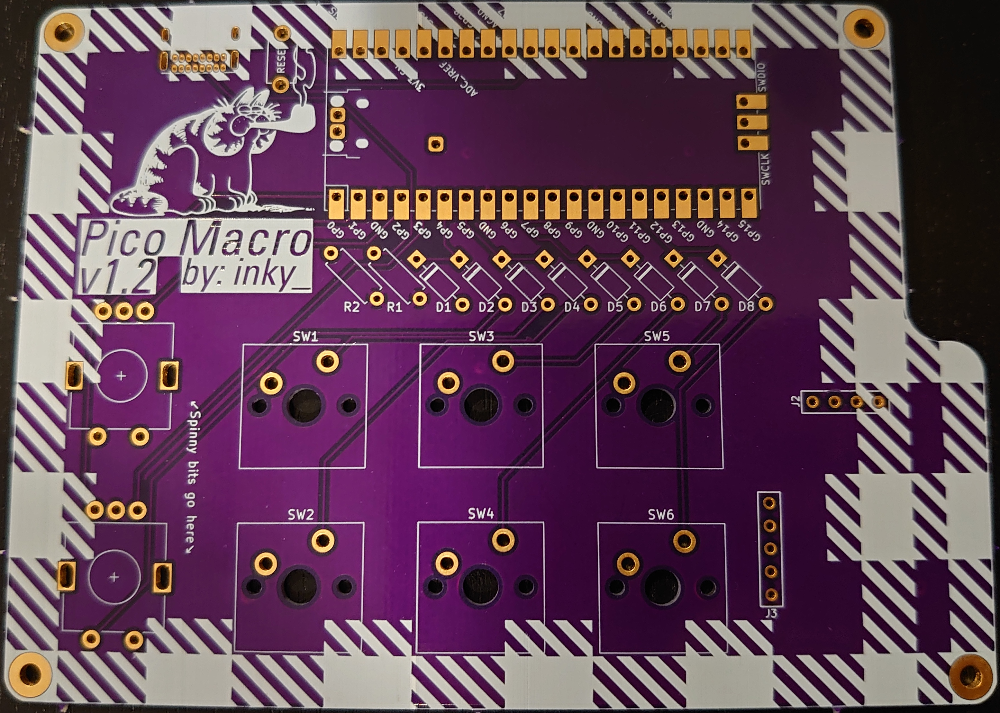

# Pico_Macro Keypad

Pico_Macro is 3*2 keys plus two rotary encoders w/ push button as well as a 128x32 OLED screen and trackball. 

## Firmware

Pico_Macro uses [KMK firmware](http://kmkfw.info)

## Images

## TODO

- [ ] add pictures to readme
- [ ] Kailh choc Low Profile version
- [ ] Kailh hotswap version
- [ ] MX hotswap version
- [ ] hybrid socket version

