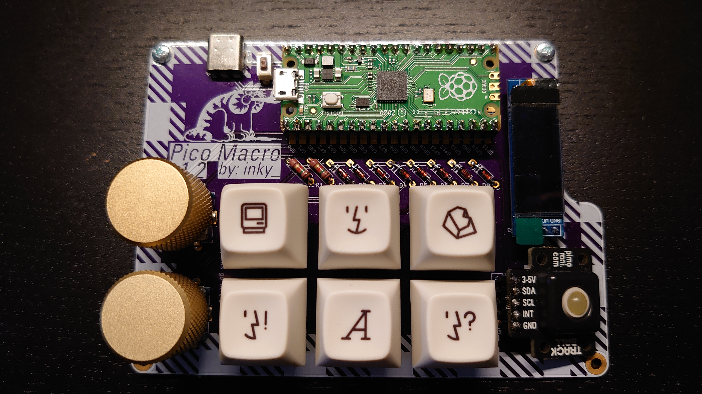

# Pico_Macro Keypad

Pico_Macro is 3*2 keys plus two rotary encoders w/ push button as well as a 128x32 OLED screen and trackball. 

## Firmware

Pico_Macro uses [KMK firmware](http://kmkfw.info)

## Images

The bare pcb: 

Populated board
 

/w Keys 

## TODO

- [x] add pictures to readme
- [ ] configure screen to work
- [ ] add support for kailh choc

